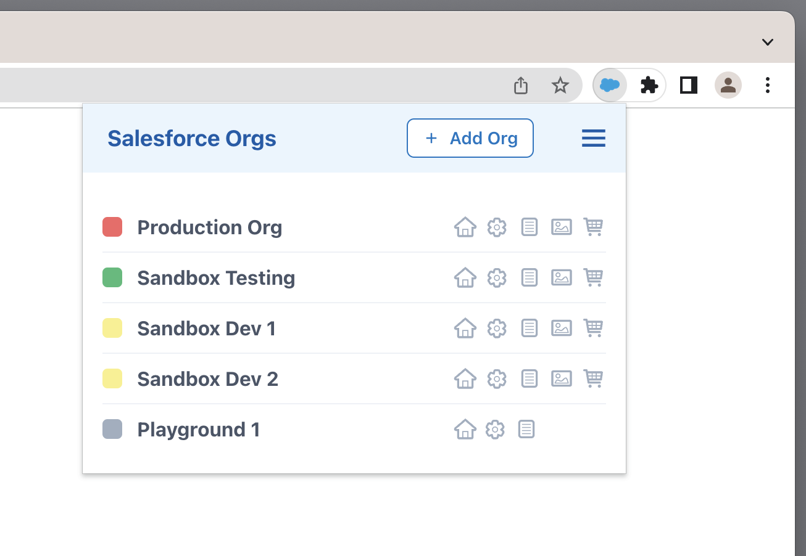
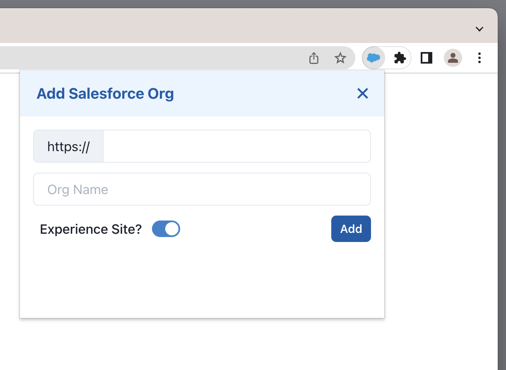
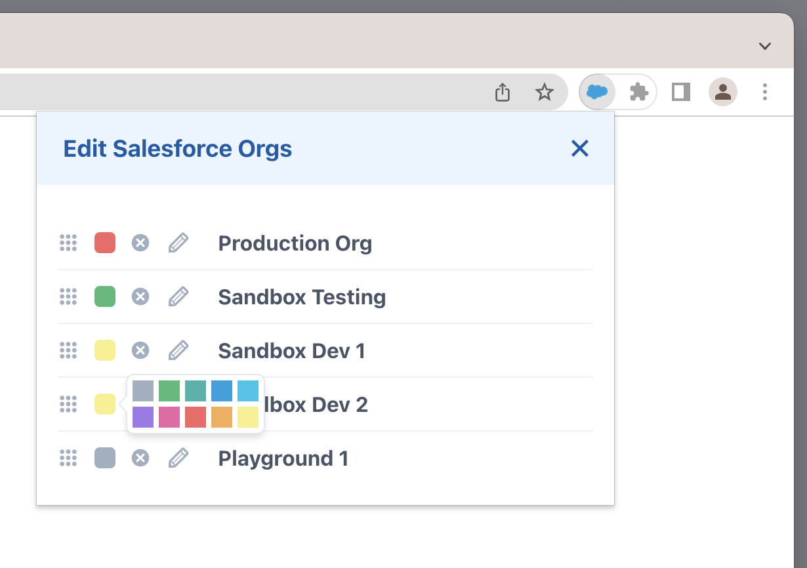
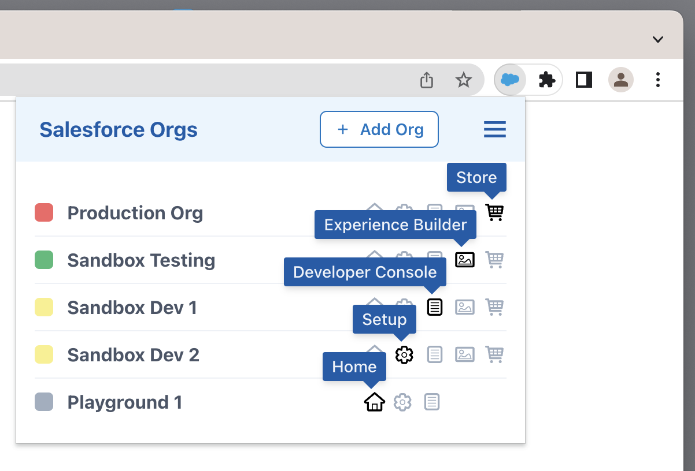

# Chrome Extension for Managing Salesforce Orgs

This extension is **not** distributed via the Chrome Web Store. It must be [installed](#user-content-install) manually.

This extension was created to fit my personal needs. It might not fit yours.

## Features

#### Add New Salesforce Org

#### Define Color of Favicon

Favicon in Browser Tab of an Org is colored as defined:

#### Open Different Features of an Org

## Usage

Open the extension on any page using the key shortcut `Command + Shift + S`.

Overwrite this shortcut on `chrome://extensions/shortcuts`.

## Install

Step 1.: Build extension

    npm install
    npm run build

Step 2.: Open `chrome://extensions/` and enable **Developer mode** in the top right.

Step 3.: Click the **Load unpacked extension** button and select the `build` folder.

## Development

The extension uses **React** components from [Chakra UI](https://chakra-ui.com/).

Customize it to fit your needs:

    gh repo clone thomd/chrome-extension-salesforce-orgs
    npm start
