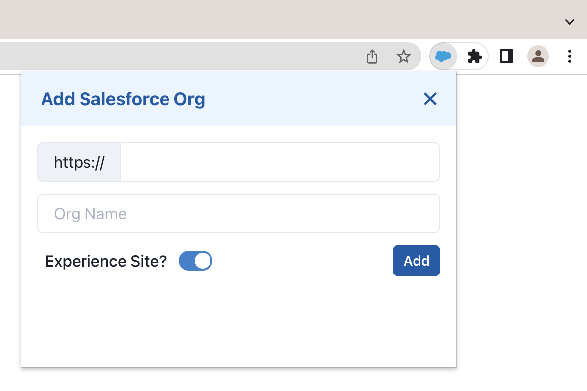
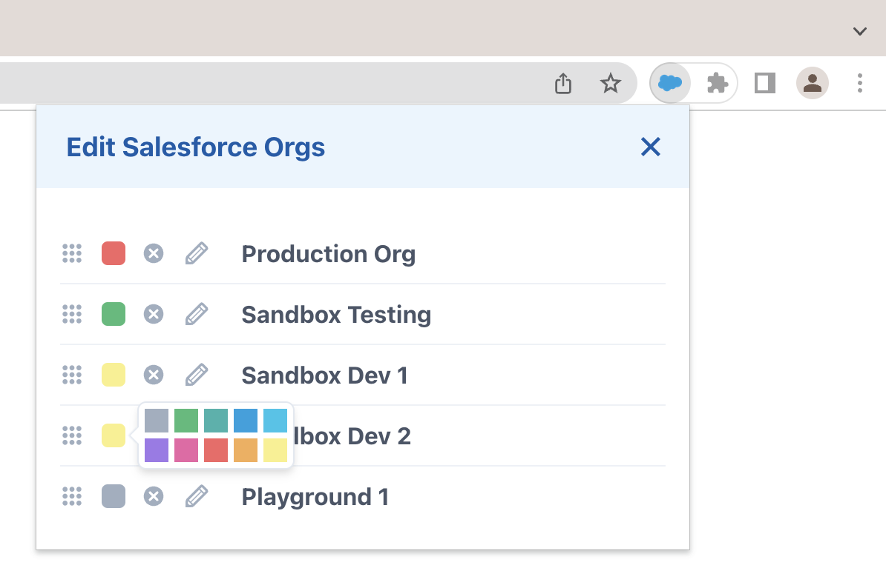
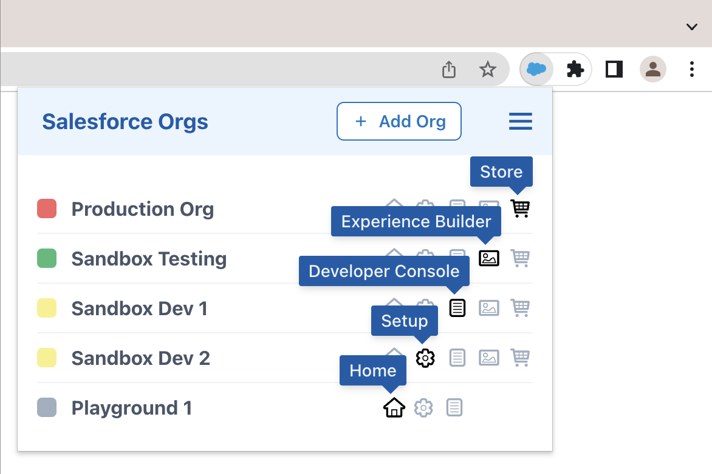

# Chrome Extension for Managing Salesforce Orgs

This extension is not distributed via the Chrome Web Store. 

Install it manually.

## Features

#### Add New Salesforce Org

#### Define Color of Favicon

Favicon in Browser Tab of an Org is colored as defined:

#### Open Different Pages of an Org

## Usage

Open extension on any page using the key shortcut `Command + Shift + S`.

## Install

1. Build extension

    npm install
    npm run build

2. Open `chrome://extensions/` and check the box for **Developer mode** in the top right.
3. Click the **Load unpacked extension** button and select the `build` folder.

## Development

The extension uses **React** components from [Chakra UI](https://chakra-ui.com/).

Customize it to fit your needs:

    gh repo clone thomd/chrome-extension-salesforce-orgs
    npm start
